# Configuration
This document will try to explain the `nvngx.ini` and in-game menu (shortcut key for opening menu is **HOME**) settings as much as possible. 

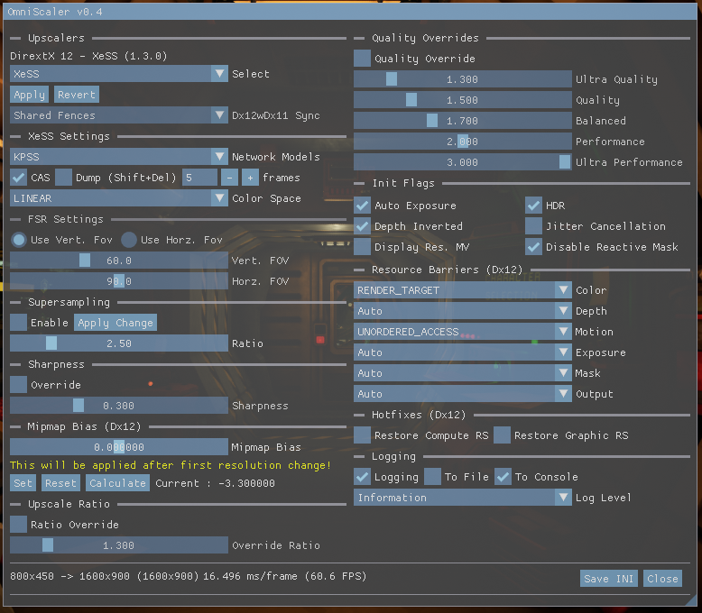

### Upscalers
OptiScaler supports DirectX 11, DirectX 12 and Vulkan APIs with multiple upscaler backends. You can select which upscaler to use in the `[Upscalers]` section of the `nvngx.ini` file.

```ini
[Upscalers]
; Select upscaler for Dx11 games
; fsr22 (native dx11), xess (with dx12), fsr21_12 (dx11 with dx12) or fsr22_12 (dx11 with dx12)
; Default (auto) is fsr22
Dx11Upscaler=auto

; Select upscaler for Dx12 games
; xess, fsr21 or fsr22
; Default (auto) is xess
Dx12Upscaler=auto

; Select upscaler for Vulkan games
; fsr21 or fsr22
; Default (auto) is fsr21
VulkanUpscaler=auto
```

* `fsr21` means FSR 2.1.2
* `fsr22` means FSR 2.2.1
* `xess` means XeSS

*For DirectX11 `fsr21_12`, `fsr22_12` and `xess` use a DirectX12 background device to be able to use DirectX12 only upscalers. There is a %10-15 performance penalty for this method, but it allows much more upscaler options. Also, the native DirectX11 implementation of FSR 2.2.1 is a backport from the Unity renderer and has it's own problems, some of which are avoided by OptiScaler.*

For selecting upscalers from in-game menus `Upscalers` section could be used.

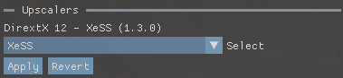

### Pseudo SuperSampling
With OptiScaler 0.4 there are new options for pseudo-supersampling under `[Upscalers]`

```ini
[Upscalers]
; Enable pseudo-supersampling option for Dx12 and Dx11 with Dx12 backends
; true or false - Default (auto) is false
SuperSamplingEnabled=auto

; Pseudo-supersampling ratio 
; 0.0 - 5.0 - Default (auto) is 2.5
SuperSamplingMultiplier=auto
```

To explain it clearly, for example, normally when your game is running at 1080p and  `Quality` is selected as DLSS preset, it would render a 720p image and send it to the upscaler with other necessary input information and generate a 1080p image as output.

If pseudo-supersampling is enabled, it uses `SuperSamplingMultiplier` to calculate the target render size of the upscaler. For 720p with default multiplier (2.5) it would be 1800p. So now the upscaler will upscale the image to 1800p instead of 1080p, then OmniSaler will downsample the output image to 1080p.

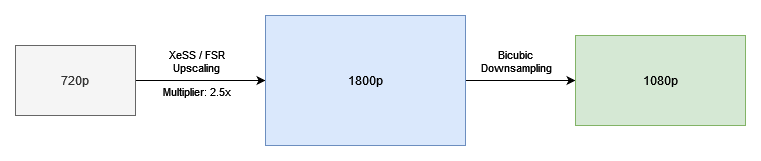

Because of the higher resolution of the upscaled target, there will be a performance loss compared to just upscaling. But subjectively it could produce images close to DLAA quality with higher performance levels.

It can be changed from the in-game menu with real-time results.

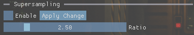

### Dx11withDx12 Sync Settings
For DirectX11 with `fsr21_12`, `fsr22_12` and `xess` upscaler options, OptiScaler uses a DirectX12 background device to be able to use these DirectX12 only upscalers. This is a very niche feature and can cause issues with unstable GPU drivers (especially on Intel). To mitigate and prevent crashes or graphical issues, this option could be used.

```ini
[Dx11withDx12]
; Safe syncing measures for Dx11 with Dx12
; Might be needed for Intel Arc cards or different Dx11 drivers
;
; Valid values are;
;	0 - Safe syncing is off                         (fastest, most prone to errors)
;	1 - Only Fences
;	2 - Fences + Flush after Dx11 texture copies
;	3 - Sync after output copy				            (most compatible)
;	4 - No fences, all sync done with queries       (slowest)
;
; 0 is fastest, 4 is slowest
;
; Default (auto) is 1
UseSafeSyncQueries=auto
```

It can be changed from the in-game menu with real-time results.


### XeSS Settings

```ini
[XeSS]
; Building pipeline for XeSS before init
; true or false - Default (auto) is true
BuildPipelines=auto 

;Select XeSS network model
; 0 = KPSS
; 1 = Splat
; 2 = Model 3
; 3 = Model 4
; 4 = Model 5
; 5 = Model 6
;
; Default (auto) is 0
NetworkModel=auto

[CAS]
; Enables CAS shapening for XeSS
; true or false - Default (auto) is false
Enabled=auto

; Color space conversion for input and output
; Possible values are at the end of the file - Default (auto) is 0
ColorSpaceConversion=auto
```

The `BuildPipelines` parameter allows XeSS pipelines to be built during context creation to prevent stuttering later.

`NetworkModel` is for selecting the network model to be used with XeSS upscaling. **(Currently has no visible effect on the upscaled image)**

#### CAS
Normally XeSS tends to produce softer final image compared to other upscalers and has no sharpening option to mitigate it. So OptiScaler allows you to use AMD's CAS sharpening filter on the final image to balance upscaled images soft look. CAS is not perfect though, on some games it causes some artifacts/issues like dissapering bloom effects, shifting color tone of the image or causing black screen with no image at all.

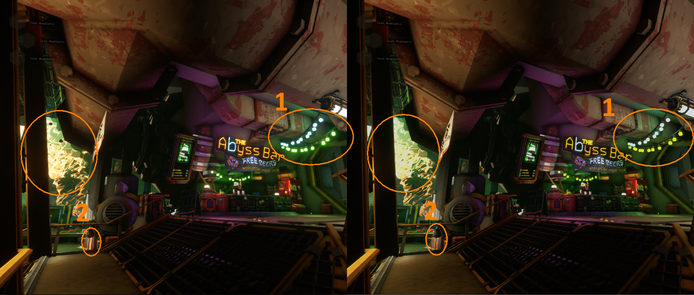

1. Bloom removed
2. Color tone is changed
   
`ColorSpaceConversion` to fix color space conversion issues but **almost always** the default setting would work fine.

It can be changed from the in-game menu with real-time results.

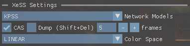

`Dump` option is for debugging purposes, which would dump input and output parameters and textures for XeSS to game folder.

### FSR Settings

```ini
[FSR]
; 0.0 to 180.0 - Default (auto) is 60.0
VerticalFov=auto

; If vertical fov is not defined will be used to calculate vertical fov
; 0.0 to 180.0 - Default (auto) is off
HorizontalFov=auto
```

To improve the image quality you can try to match the vertical or horizontal FOV of your game with these settings. The default is 60° vertical FOV and most of the time it works fine.

It can be changed from the in-game menu with real-time results.

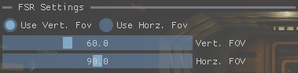

### Shapness
DLSS used to have a sharpening option, but later it was removed. So some games have sharpness slider and some do not. With this option you can disable or enable the sharpness of the final image. FSR has built in sharpness but for XeSS CAS option must be enabled.

```ini
[Sharpness]
; Override DLSS sharpness paramater with fixed shapness value
; true or false - Default (auto) is false
OverrideSharpness=auto

; Strength of sharpening, 
; value range between 0.0 and 1.0 - Default (auto) is 0.3
Sharpness=auto
```

It can be changed from the in-game menu with real-time results.

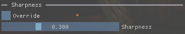

### Upscaling Ratios
OptiScaler provides several options for overriding and locking upscaling ratios.

#### Upscale Ratio Override
`UpscaleRatioOverride` allows you to select a single upscale ratio for all quality presets.

```ini
[UpscaleRatio]
; Set this to true to enable the internal resolution override 
; true or false - Default (auto) is false
UpscaleRatioOverrideEnabled=auto

; Set this to true to enable limiting DRS max resolution to overriden ratio
; true or false - Default (auto) is false
DrsMaxOverrideEnabled=auto

; Set the forced upscale ratio value
; Default (auto) is 1.3
UpscaleRatioOverrideValue=auto
```

This can be changed and saved from the in-game menu, but usually the change will take effect after a restart or resolution change.

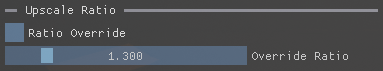

#### Quality Ratio Override
`QualityRatioOverride` allows you to override the upscale ratio for each quality preset.

```ini
[QualityOverrides]
; Set this to true to enable custom quality mode overrides
; true or false - Default (auto) is false
QualityRatioOverrideEnabled=auto

; Set custom upscaling ratio for each quality mode
;
; Default (auto) values:
; Ultra Quality         : 1.3
; Quality               : 1.5
; Balanced              : 1.7
; Performance           : 2.0
; Ultra Performance     : 3.0
QualityRatioUltraQuality=auto
QualityRatioQuality=auto
QualityRatioBalanced=auto
QualityRatioPerformance=auto
QualityRatioUltraPerformance=auto
```

**
If both overrides are enabled, the `UpscaleRatioOverride` has priority over the `QualityRatioOverride`**

When `DrsMaxOverrideEnabled` is enabled, it limits the maximum internal rendering resolution to the default rendering resolution instead of the display resolution for DRS supported games. When enabled, it effectively disables DRS. Works with both `QualityRatioOverride` and `UpscaleRatioOverride`.

These can be changed and saved from the in-game menu, but usually the change will take effect after a restart or resolution change.

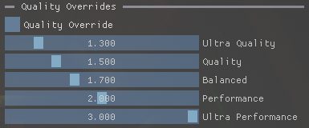

### Init Flags
These settings allow you to override the DLSS init flags to fix some issues.

```ini
[Depth]
; Force add INVERTED_DEPTH to init flags
; true or false - Default (auto) is DLSS value
DepthInverted=auto

[Color]
; Force add ENABLE_AUTOEXPOSURE to init flags
; Some Unreal Engine games needs this, fixes colors specially in dark areas
; true or false - Default (auto) is  DLSS value
AutoExposure=auto

; Force add HDR_INPUT_COLOR to init flags
; true or false - Default (auto) is  DLSS value
HDR=auto

[MotionVectors]
; Force add JITTERED_MV flag to init flags
; true or false - Default (auto) is  DLSS value
JitterCancellation=auto

; Force add HIGH_RES_MV flag to init flags
; true or false - Default (auto) is  DLSS value
DisplayResolution=auto

[Hotfix]
; Force remove RESPONSIVE_PIXEL_MASK from init flags
; true or false - Default (auto) is true
DisableReactiveMask=auto
```

Enabling `AutoExposure` helps correct problems with dark or washed-out colors.


Enabling `HDR` has been reported to help with purple hue in some games.

Enabling `DisableReactiveMask` can help FSR backends in some games, but it usually causes more problems than it solves. That's why it is disabled by default.


Some games may set the motion vector size flag incorrectly, causing excessive motion blur when the camera moves. Enabling or disabling `DisplayResolution` might help in these situations.


These can be changed from the in-game menu with real-time results.


### Resource Barriers (Dx12 Only)
Some games (especially Unreal Engine) send input resources to DLSS in wrong states, which leads to graphical problems (especially on AMD hardware). Normally OptiScaler tries to detect the engine type and mitigate these problems, but sometimes games do not report this information correctly. To fix problems, these ini parameters would help.

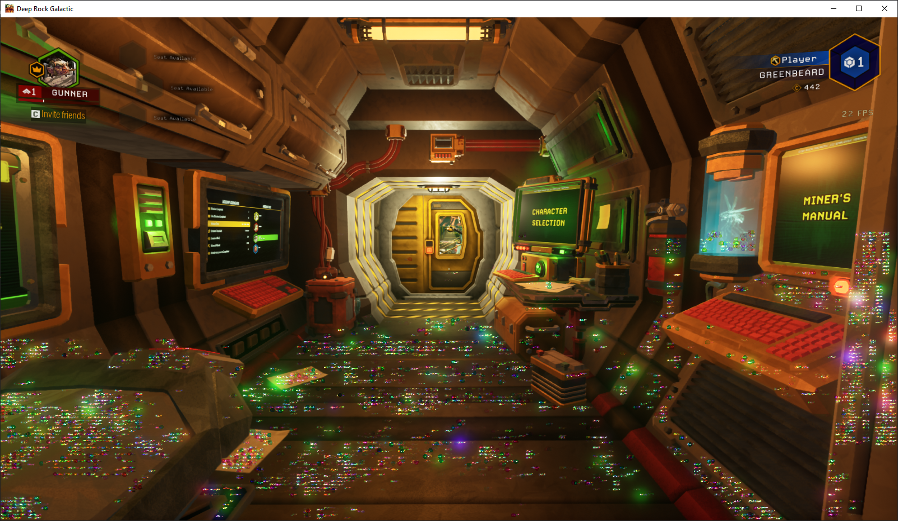

**Setting a wrong resource state here can cause a crash!**

```ini
[Hotfix]
; Color texture resource state to fix for rainbow colors on AMD cards (for mostly UE games) 
; For UE engine games on AMD, set it to D3D12_RESOURCE_STATE_RENDER_TARGET (4)
; Default (auto) is state correction disabled
ColorResourceBarrier=auto

; MotionVector texture resource state, from this to D3D12_RESOURCE_STATE_NON_PIXEL_SHADER_RESOURCE (for mostly debugging) 
; Default (auto) is state correction disabled
MotionVectorResourceBarrier=auto 

; Depth texture resource state, from this D3D12_RESOURCE_STATE_NON_PIXEL_SHADER_RESOURCE (for mostly debugging) 
; Default (auto) is state correction disabled
DepthResourceBarrier=auto

; Color mask texture resource state, from this D3D12_RESOURCE_STATE_NON_PIXEL_SHADER_RESOURCE (for mostly debugging) 
; Default (auto) is state correction disabled
ColorMaskResourceBarrier=auto

; Exposure texture resource state, from this D3D12_RESOURCE_STATE_NON_PIXEL_SHADER_RESOURCE (for mostly debugging) 
; Default (auto) is state correction disabled
ExposureResourceBarrier=auto

; Output texture resource state, from this D3D12_RESOURCE_STATE_UNORDERED_ACCESS (for mostly debugging) 
; Default (auto) is state correction disabled
OutputResourceBarrier=auto
```

These can be changed from the in-game menu with real-time results.

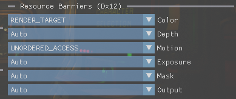

### Mipmap LOD Bias Override (Dx12 Only)
To achieve better texture clarity, `MipmapLodBias` can be overridden with this setting. -15 is the sharpest and +15 is the fuzziest.

```ini
[Hotfix]
; Override mipmap lod bias for textures
; -15.0 - 15.0 - Default (auto) is disabled
MipmapBiasOverride=auto
```

**Adjusting MipmapLODBias has an impact on performace!**

It can be changed from the in-game menu, needs resolution change to be effective.

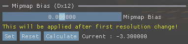

### Restore Root Certificates (Dx12 Only)
This hotfix is based on the original CyberFSR2's restoring ComputeRootSignature logic, I also added the option to restore ComputeRootSignature. I haven't noticed any games that need these options.

```ini
[Hotfix]
; Restore last used compute signature after upscaling
; true or false - Default (auto) is false
RestoreComputeSignature=auto

; Restore last used graphics signature after upscaling
; true or false - Default (auto) is false
RestoreGraphicSignature=auto
```

These can be changed from the in-game menu with real-time results.

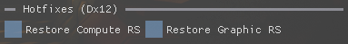

### Logging
```ini
[Log]
; Logging
; true or false- Default (auto) is true
LoggingEnabled=auto

; Log file, if undefined log_xess_xxxx.log file in current folder
;LogFile=./CyberXess.log

; Verbosity level of file logs
; 0 = Trace / 1 = Debug / 2 = Info / 3 = Warning / 4 = Error
; Default (auto) is 2 = Info
LogLevel=auto

; Log to console (Log level is always 2 (Info) for performance reasons) 
; true or false - Default (auto) is false
LogToConsole=auto

; Log to file 
; true or false - Default (auto) is false
LogToFile=auto

; Log to NVNGX API
; true or false - Default (auto) is false
LogToNGX=auto

; Open console window for logs
; true or false - Default (auto) is false
OpenConsole=auto
```

These can be changed from the in-game menu with real-time results.

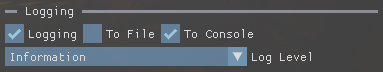


